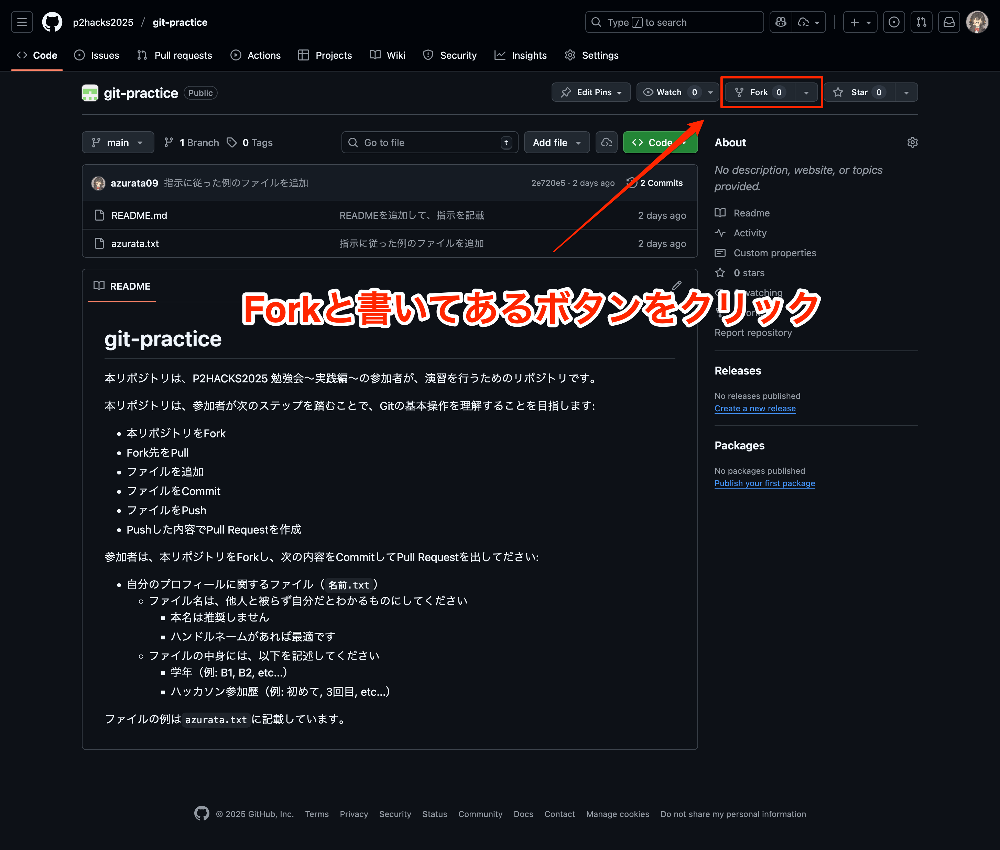
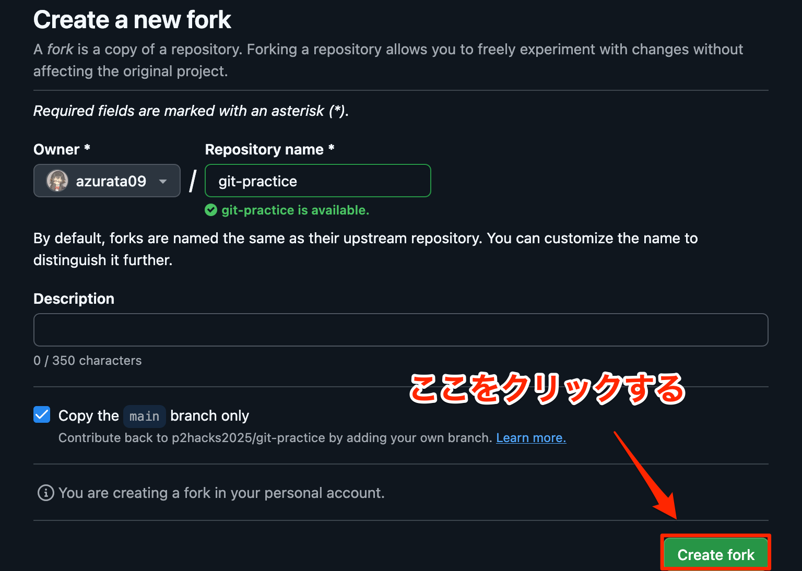

# git-practice

本リポジトリは、P2HACKS2025 勉強会～実践編～の参加者が、演習を行うためのリポジトリです。

以降、本リポジトリをもとに行うハンズオンを「本ハンズオン」と呼びます。

## 本ハンズオンの目的

本ハンズオンは、参加者が次のステップを踏むことで、P2HACKS2025でソースコードを提出できるようになることを目的としています。

- 本リポジトリをFork
- Fork先をPull
- ファイルを追加
- ファイルをCommit
- ファイルをPush
- Pushした内容でPull Requestを作成

---

## ハンズオン

### ForkしてPull

まずは、本リポジトリをForkし、Fork先のリポジトリをPullしてください。

Forkする方法は、本ページの右上にある「Fork」ボタンを押すだけです。





Fork後は、自分のアカウントに`git-practice`という名前のリポジトリが作成されているはずです。

次に、Fork先のリポジトリをPullします。

```console
$ git clone git@github.com:<あなたのアカウント名>/git-practice.git

記入例
$ git clone git@github.com:azurata09/git-practice.git
```

### コミットログの確認

現状での変更履歴を確認しましょう。

```console
$ git log --oneline --graph
* 2e720e5 (HEAD -> main, origin/main, origin/HEAD) 指示に従った例のファイルを追加
* 977de49 READMEを追加して、指示を記載
```


### ファイルを追加

次に、自分のプロフィールに関するファイルを追加します。

次のコマンドを実行して、ダウンロードしたリポジトリのフォルダを開きます。

```console
$ cd git-practice

Windowsの場合
$ explorer.exe .

Macの場合
$ open .
```

ファイラが開くので、そこに新しいテキストファイルを追加してください:

- ファイル名は、他人と被らず自分だとわかるものにしてください（`<名前>.txt`）
  - 本名は推奨しません
  - ハンドルネームがあれば最適です
- ファイルの中身には、以下を記述してください
  - 学年（例: B1, B2, etc...）
  - ハッカソン参加歴（例: 初めて, 3回目, etc...）

ファイルの例は`azurata.txt`に記載しています。

### ファイルをCommit

ファイルを追加したら、次にその変更をCommitします。

```console
$ git add .
$ git commit -m "Add profile"
```

`-m`オプションの後には、変更内容を簡潔に表すメッセージを記載します。
今回は「Add profile」としました。

この時点で、もう一度コミットログを確認してみましょう。

```console
$ git log --oneline --graph
* abcdefg (HEAD -> main) Add profile
* 2e720e5 (origin/main, origin/HEAD) 指示に従った例のファイルを追加
* 977de49 READMEを追加して、指示を記載
```

### ファイルをPush

Commitが完了したら、次にPushします。

```console
$ git push origin main
```

先ほどForkした、`<あなたのアカウント名>/git-practice`リポジトリに変更履歴が追加されます。
リロードして確認してみましょう。

